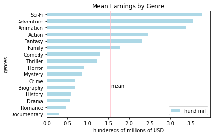

# Movie Production Analysis

**Author**: Elimelech Berlin

## Overview

This report analyzes available movie data to identify several aspects of successful films. The data used for this analysis includes information about movie earnings and other aspects of those films. By analyzing this information, several actionable insights about successful movies are revealed.


## Business Problem

As not all movies are created equal, producing the 'right' type of movie can be a tricky thing. There are a variety of factors that can influence the success and profitablity of a release; these factors are not always apparent. By analyzing available data about a large number of movies (both successful and unsuccessful), we can identify how certain factors impact the earnings of a film. In this report I aim to examine how movie genre and language impact movie profitability.


## Data

I will be using data from these two files: [im.db.zip](./data/zippedData/im.db.zip) and [bom.movie gross.csv.gz](./data/zippedData/bom.movie_gross.csv.gz). They contain data from the following movie data websites: [Box Office Mojo](https://www.boxofficemojo.com/ 'https://www.boxofficemojo.com/'), [IMDB](https://www.imdb.com/ 'https://www.imdb.com/'), [Rotten Tomatoes](https://www.rottentomatoes.com/ 'https://www.rottentomatoes.com/'), [The Movie DB](https://www.themoviedb.org/ 'https://www.themoviedb.org/') and [The Numbers](https://www.the-numbers.com/ 'https://www.the-numbers.com/').

Included in this data is both business information and creative/content information. I will be focusing on some of the business data (earnings) but with an understanding of how it's influenced by other data (genre, language).


## Methods

In this report I use descriptive analytics to understand how movie genre and movie revenue are related. I also examine the apparent affect of language on earnings. For most of my analysis I use information about mean earnings to get a sense of what movies in a particular category earned.


## Results

  
  


Several patterns emerge from the analysis:
* Certain movie genres are more profitable than others.
* Films released in certain languages earn more money than films in other languages.
* The number of languages in which a movie is released has a consistent affect on that films earnings. (More languages = more revenue.) An odd exception to this: movies in 2 languages earn less than movies in a single language. 


## Conclusions

Three recomendations based on the above anaysis are:
* Movies produced should be in one of the top genres for earnings. (Publishing movies of only the highest earning genre doesn't seem like a great idea for a company's reputation; it seems dull & unexciting & may drive away business.)  
The 5 highest earning genres are (in order of descending profitability):
    * adventure
    * animation
    * action
    * fantasy  
* Because movies released in more languages earn more money, the number of languages the movies are available in should be maximized. This is markedly more so when movies are produced for a foreign market. *Further exploration is needed to understand why movies available in 1 language earn more than movies in 2.*
  
* Films in certain languages are more profitable, therefore, production (especially for foreign markets) should focus on movies in those languages. It should be noted that foreign earnings of a movie by language is certainly influenced by the region in which a movie is released & should be taken into account when determining the release language of a given film.  
The top earning languages are (in descending order):
    * Dutch
    * Persian
    * Hindi
    * Mandarin Chinese
    
It should be noted that this analysis only examined what movies grossed the most money, but did not take into account that certain movies may have higher costs (e.g. production, marketing), thus reducing actual profit. Further analysis should include that information to determine which movies are truly the most profitable.Provide your conclusions about the work you've done, including any limitations or next steps.
*** 

## For More Information

Please review the full analysis in [the Jupyter Notebook](./dsc-phase1-project-template.ipynb) or the [presentation](./DS_Project_Presentation.pdf).

For any additional questions, please contact **Elimelech Berlin, melech.berlin@gmail.com**

## Repository Structure

Describe the structure of your repository and its contents, for example:

```
├── README.md                           <- The top-level README for reviewers of this project
├── dsc-phase1-project-template.ipynb   <- Narrative documentation of analysis in Jupyter notebook
├── DS_Project_Presentation.pdf         <- PDF version of project presentation
├── data                                <- Both sourced externally and generated from code
└── images                              <- Both sourced externally and generated from code
```
